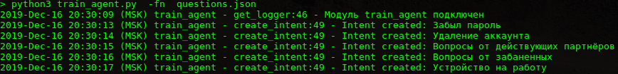
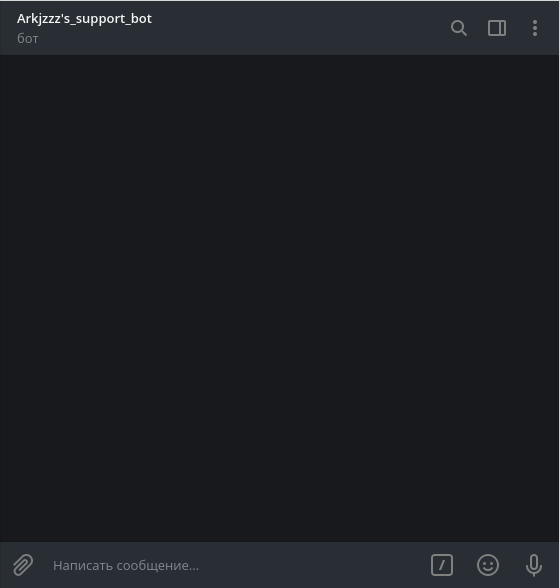
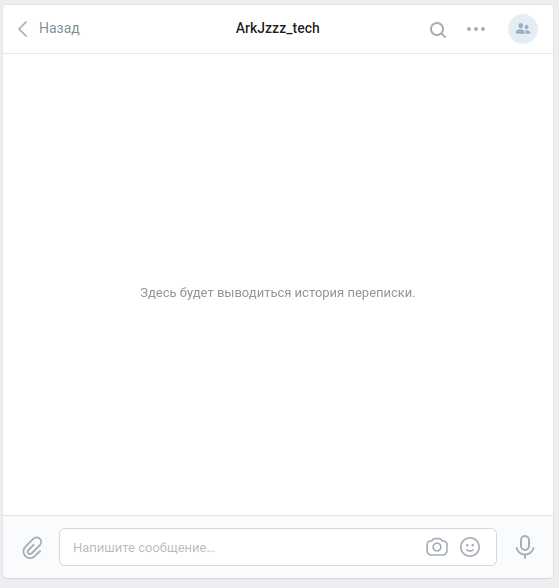

# support-bot 

Бот-помощник для службы поддержки, отвечает на часто задаваемые вопросы в чате Telegram и в группе ВКонтакте.


## Подготовка

1. **DialogFlow**

    [Создайте проект в DialogFlow](https://cloud.google.com/dialogflow/docs/quick/setup);

    [Создайте Агента](https://cloud.google.com/dialogflow/docs/quick/build-agent);

    [Создайте service-account с доступом к DialogFlow](https://dialogflow.com/docs/reference/v2-auth-setup) и сохраните ключ под именем ```google-credentials.json```;

    Создайте файл ```<filename.json>``` [такого формата](https://dvmn.org/media/filer_public/a7/db/a7db66c0-1259-4dac-9726-2d1fa9c44f20/questions.json) с тренировочными фразами и ответами;
    
    Обучите нейросеть DialogFlow тренировочными фразами и ответами из файла ```<filename.json>``` с помощью ```train_agent.py```:

    ```
    python3 train_agent.py -fn <filename.json>
    ```

    
    


2. **Telegram**

    Напишите [Отцу ботов](https://telegram.me/BotFather):

    ```
    \start
    ```

    ```
    \newbot
    ```

    Получите токен для доступа к API Telegram.

3. **ВКонтакте**

    Создайте группу во [ВКонтакте](https://vk.com/groups?tab=admin);

    Получите токен группы в настройках сообщества.


## Установка

1. Клонировать репозиторий:
```
git clone https://github.com/ArkJzzz/support_bot.git
```
2. Создать файл ```.env``` и поместить в него токены Telegram и ВКонтакте:
```
TELEGRAM_TOKEN='Ваш токен'
VK_TOKEN='Ваш токен'
```
3. Установить зависимости:
```
pip3 install -r requirements.txt
```

## Запуск
```
python3 bot-tg.py
```



```
python3 bot-vk.py
```



